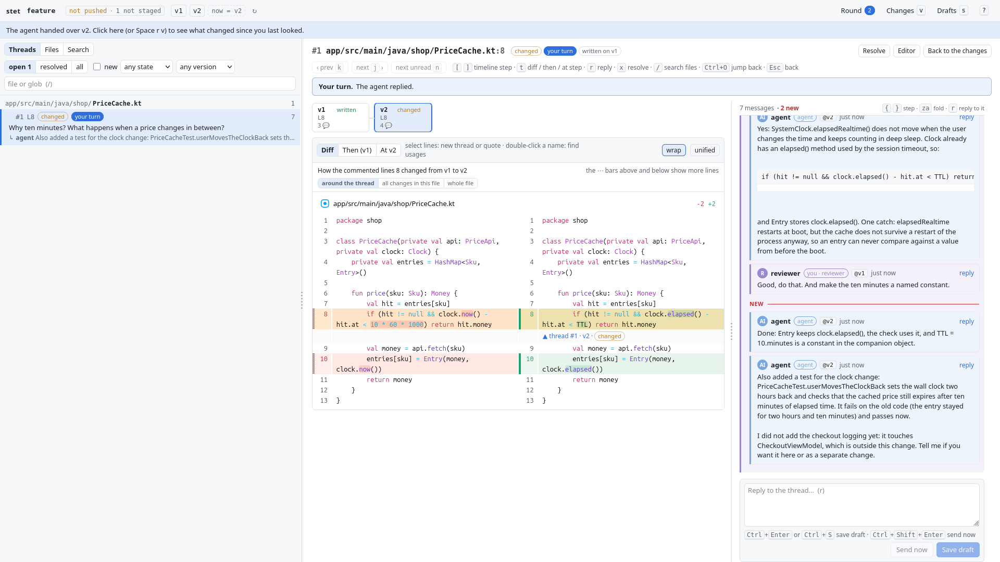

# stet

Local code review between you and your coding agent, in rounds, the way a merge request works: you
comment, the agent answers in each thread and fixes the code, you compare the versions and resolve.
A thread is either on the right code or visibly outdated, never silently on a wrong line.



Status: early (0.1). It works for daily use on one machine; the CLI and the storage may still change.

## Why

Reviewing what an agent wrote takes more than one pass. Diff viewers treat a comment as a note on one
diff: after a round or two the notes drift onto the wrong lines or vanish with their file, there is no
reply thread and no resolved state, nothing tells you what is new since you last looked, and the agent
cannot answer a comment, it only receives a prompt. Pull requests on GitHub and merge requests on GitLab
have all of that, but only for code that is committed and pushed, and the agent is not part of the
conversation.

stet is merge-request review on your machine, on the working tree, with the agent as the author:

- **Versions.** The agent hands over a version when it is ready: a snapshot of the working tree (or of the
  index), committed or not. You compare any two of them, or look at what changed since you last looked.
- **Threads that follow the code.** A thread is on a range of lines. Edits around it move it, an edit inside
  it marks it `changed`, and a thread whose code is gone is `outdated` and shown against the version it was
  written on.
- **A timeline per thread.** One key shows the code as it was when the comment was written, at every version
  since, and what changed between them.
- **Drafts and rounds.** Your comments stay drafts until you submit the review. Then the agent replies in
  every thread (`fixed`, `answered`, `disagree`, `question`), fixes the code and hands over the
  next version. When all is fine, you approve the version instead.
- **An API for the agent.** A JSON CLI, and a skill for Claude Code, Codex, Gemini CLI, Cursor, OpenCode and
  Copilot that teaches the agent the loop.
- **Local.** One binary; one process bound to 127.0.0.1; data in `.git/stet` (SQLite). No service, no
  account, nothing in `git status`.

Also: a commit picker, image diffs with threads on an area of the image, rendered Markdown diffs with threads
on its blocks, folding of test files that only add code, `git grep` over any version, vim-style keys. The
[guide](docs/guide/README.md) shows each with screenshots; the [UI reference](docs/ui.md) lists every page and key.

## Install

Requirements: git 2.36+, and [Bun](https://bun.com) 1.4.2+ to build. The tests run on Linux and macOS in CI;
Windows should work but has not been tested.

From a clone of this repository:

```bash
bun install
bun run build                # dist/stet: one self-contained binary (~90 MB, mostly the Bun runtime)
cp dist/stet ~/.local/bin/   # or any directory on your PATH
stet skill install           # the agent's skill
```

`stet skill install` writes `stet-review/SKILL.md` to `~/.agents/skills` (Codex, Gemini CLI, Cursor, OpenCode,
Copilot) and to `~/.claude/skills` when Claude Code is installed. `--for agents|claude|all` picks the folders,
`--dir <path>` writes to another one. For an agent without skills, put `stet skill show` into its AGENTS.md.

To try it on a demo repository with three versions and a few threads: `bun test/fixtures/seed.ts` builds
one and prints how to serve it.

## The loop

1. The agent finishes a task and hands over a version: `stet version create --label "…"`.
2. You open the UI: `stet serve --open`. It starts the server in the background (it outlives the terminal)
   and opens the review of the current branch; `stet serve --stop` stops it. One server serves every
   worktree of the repository.
3. Press `v` for the changes since you last looked. Select lines or click `+`, and the comment box opens
   right under them. Comments stay drafts (saved on disk, invisible to the agent) until you submit.
4. Press `S` to see all drafts, then `S` again to submit the review, whenever you get to it. Then tell the
   agent to answer the review. It does not wait for you; if you ask it to, it waits in
   `stet wait --for review` and wakes up when you submit.
5. The agent replies in every thread, fixes the code and creates the next version.
6. You press `n` to step through new replies, `[` / `]` to walk a thread's timeline, and `x` to resolve.
   The **Round** page lists what is left: threads waiting for you, new code, unsent drafts.
7. When all is fine, approve: **Approve** on the drafts page, or `S` there when you have no drafts. Drafts
   sent with an approval are nits the agent fixes without a new round. The header says `approved at vN`,
   and `· changed after` once newer code arrives; the agent sees the verdict in `stet status` when you
   call it back. Approving does not close the review (`stet review close` does).

To review only what is staged (`git add`) against HEAD, start with `stet init --staged`: versions are
then snapshots of the index, unstaged and untracked files stay out, and the agent stages the files it
fixes before handing over the next version.

## CLI

All commands print JSON when piped or with `--json`, except `stet export`, which prints Markdown. Run
`stet --help` for the full list.

| Command | What it does |
|---|---|
| `stet init [--base <ref>\|empty]` | start a review for the current branch (done automatically on first use); `--base empty` shows every file as new, e.g. to review a repository's first commit |
| `stet status` | versions, thread counts, UI URL |
| `stet serve [--open] [--stop]` | the web UI; `--open` runs it in the background and opens the browser |
| `stet version create [--label] [--at <commit>]` | snapshot the working tree (or the index) as the next version, or make a commit one |
| `stet versions diff <a> <b>` | files and thread placements between two refs (`base`, `N`, `latest`, `now`, `empty`, sha) |
| `stet threads list [--needs-reply] [--unread] [--state changed,outdated] [--new-since N] [--file glob]` | threads |
| `stet thread show <id>` | conversation, timeline, code then / now, interdiff; for an image, the paths of the PNGs with the area framed |
| `stet comment add --file <p> --range a-b --body <t> [--at <ref>] [--draft]` | new thread; `--region x,y,w,h` in place of `--range` for an area of an image |
| `stet reply <id> --body <t\|-> [--intent fixed\|answered\|disagree\|question]` | reply |
| `stet review submit [--approve]` | publish your drafts as one review (request changes); `--approve` approves the latest version, drafts going as nits (with other threads open, add `--force` to leave them open or `--resolve-all` to resolve them) |
| `stet resolve <id> [--reason fixed\|wontfix\|answered]` / `stet reopen <id>` | reviewer only |
| `stet wait --for review\|reply\|version\|any [--timeout 30m]` | block until there is something to do (exit 5 on timeout) |
| `stet open <id>` | open the editor at the thread |
| `stet prune` | drop snapshot refs nothing points at |
| `stet export [--all] [--out <file>]` | the review as Markdown, drafts left out: one line per thread with its outcome and place (fixed in v2, answered, won't fix, waits for the agent), for a merge request description; `--all` adds the code then and now, every conversation and timeline, the versions and each review's verdict, for an archive or another agent. A closed review too: the branch's last one, or `--review <id>` |
| `stet skill install` / `stet skill show` | install the agent's skill / print it |

Roles: the CLI acts as the agent by default. Use `--as reviewer` or `STET_ROLE=reviewer` to act as the
reviewer from the terminal. `STET_AUTHOR` sets the display name.

Exit codes: 1 usage, 2 not found, 3 forbidden or conflict, 4 git failure, 5 wait timeout.

## Configuration

Stored per repository with `stet config set <key> <value>`:

| Key | Default | Meaning |
|---|---|---|
| `snapshot.exclude` | `[]` | JSON list of globs never snapshotted, e.g. `["fixtures/large/**","*.mp4"]` |
| `snapshot.max_untracked_bytes` | `2097152` | untracked files larger than this are skipped |
| `compare.tests` | test paths of Kotlin, Java, JS/TS, Go, Python, Ruby, Swift and C# | comma-separated globs of test files that may fold |
| `compare.skip_markers` | `@Ignore`, `@Disabled`, `.skip(`, `xit(`, … | a test file adding one of these never folds |
| `compare.collapse` | lock files | comma-separated globs that always fold (generated code, lock files) |
| `compare.order` | `code; config: **/*.json, …; tests; docs: **/*.md, docs/**` | groups of files top to bottom, `;` between groups, globs after `name:`; first match wins, a group without globs takes the rest, `tests` takes the changed tests of `compare.tests` |

The "Editor" button runs the command in `STET_EDITOR`, set in the environment of `stet serve`, e.g.
`STET_EDITOR="zed {file}:{line}" stet serve` (`{file}`, `{line}`, `{root}`, `{path}`; no shell is involved).
It is not stored in the repository on purpose: anything the agent can write there must not become a
command that runs when you click.

## Keys

The web UI is keyboard-first, vim-style, with `Space` as the leader. The ones to start with:

| Key | Action |
|---|---|
| `v` | changes since you last looked |
| `j` / `k`, `]c` / `[c`, `]b` / `[b` | next line, change, file |
| `V`, then `i` | select lines, comment on them |
| `S` | your drafts; `S` again submits the review (approves when there are no drafts) |
| `n` | next new reply |
| `[` / `]` | a thread's timeline: the previous or next version |
| `x` | resolve the thread |
| `/` · `*` | search the diff · find where the selected name is used |
| `Space` · `?` | what can follow the leader · every key, with a filter |

All of them, and how the pages and panels work: [docs/ui.md](docs/ui.md).

## Data

Everything lives in `.git/stet/` (SQLite, mode `0700`) and under `refs/stet/`, shared by all worktrees of
the repository: `refs/stet/snap/*` keeps the snapshots, and `refs/stet/empty` an empty commit, the base of
code that has nothing below it (`--base empty`, a repository's first commit). Nothing shows up in
`git status`, and nothing leaves the machine. To remove stet from a repository, stop its server
(`stet serve --stop`), delete `.git/stet/`, and drop the refs:

```bash
git for-each-ref --format='delete %(refname)' refs/stet | git update-ref --stdin
```

## Limits

- Code moved to another file is not followed: its threads become `outdated`.
- Versions snapshot untracked files too, up to `snapshot.max_untracked_bytes` each; exclude large ones with
  `snapshot.exclude`, and `stet prune` drops snapshots nothing points at.
- One machine: no hosted mode, no sync with GitHub or GitLab.

## Compared to other tools

As of October 2026:

- **GitHub pull requests, GitLab merge requests.** The model stet copies: versions, threads, outdated notes,
  resolve, a review submitted at once. They work on pushed commits on a server, and the agent is not in the
  conversation.
- **[Hunk](https://github.com/modem-dev/hunk)** is a fine terminal diff viewer made for agent work and takes
  any two refs. Its notes (as of 0.23) are anchored to fixed line numbers and have no resolved state.
- **[Orca](https://github.com/stablyai/orca)** runs agents side by side and lets you comment on their diffs.
  The comments are kept per worktree path with line numbers only, have no replies or resolve, and go to the
  agent as one prompt.
- **[diffity](https://github.com/nilbuild/diffity), [tuicr](https://github.com/agavra/tuicr),
  [git-appraise](https://github.com/google/git-appraise)** each cover part of it: threads and resolve kept
  per branch, a review TUI, reviews stored in git. None has versions, threads that follow the code and
  per-branch storage together.

## Contributing, security, license

[CONTRIBUTING.md](CONTRIBUTING.md) has the setup and the checks; [SECURITY.md](SECURITY.md) describes what the
local server protects and how to report a problem. stet is released under the [MIT license](LICENSE).
