# Guide

Where to click, with arrows. The screenshots are taken on small demo repositories; how to retake them is in
[CONTRIBUTING.md](../../CONTRIBUTING.md#guide-screenshots). Every key and panel is listed in the
[UI reference](../ui.md).

- [Navigation](#navigation)
- [Which code: from and to](#which-code-from-and-to)
- [Many versions](#many-versions)
- [Images](#images)
- [Markdown](#markdown)
- [Git state and fresh data](#git-state-and-fresh-data)
- [Test files that only add code are folded](#test-files-that-only-add-code-are-folded)
- [Check the agent's claim without leaving the thread](#check-the-agents-claim-without-leaving-the-thread)
- [Compare commits](#compare-commits)
- [Long conversations](#long-conversations)
- [Files are ordered by kind](#files-are-ordered-by-kind)

## Navigation

Three pages (Round, Changes, Drafts) and a thread page. Everything has a key; the mouse works too, and
every thread, file and version is a real link (middle click opens a new tab). **Copy link** on the box of
selected lines, or `Space g Y`, copies a link that opens the Changes page at exactly those lines, highlighted.

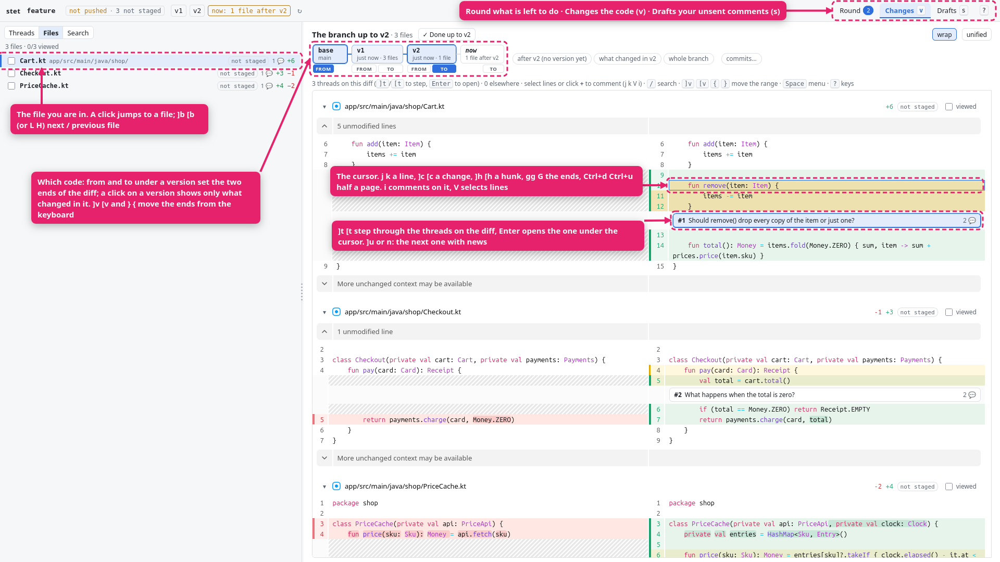

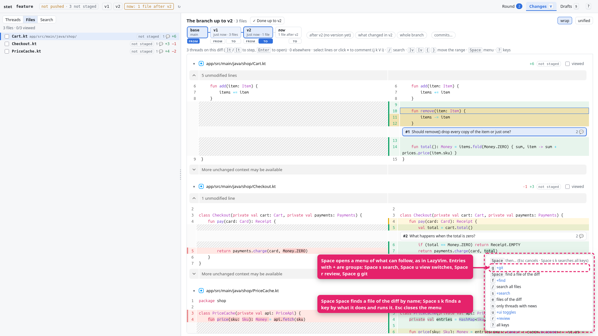

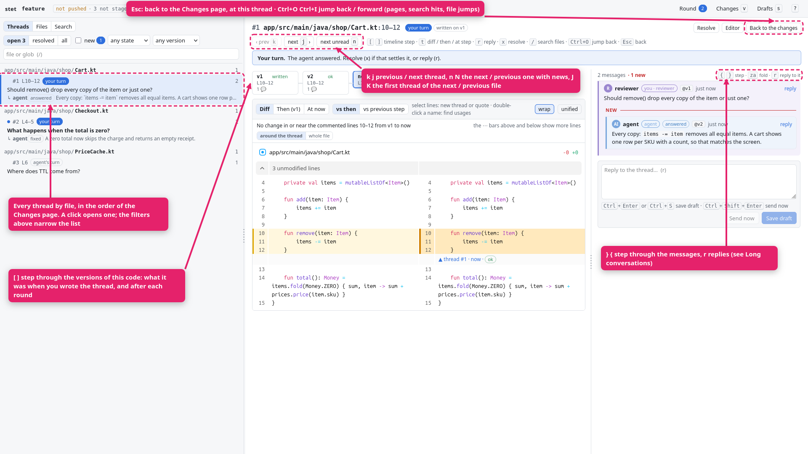

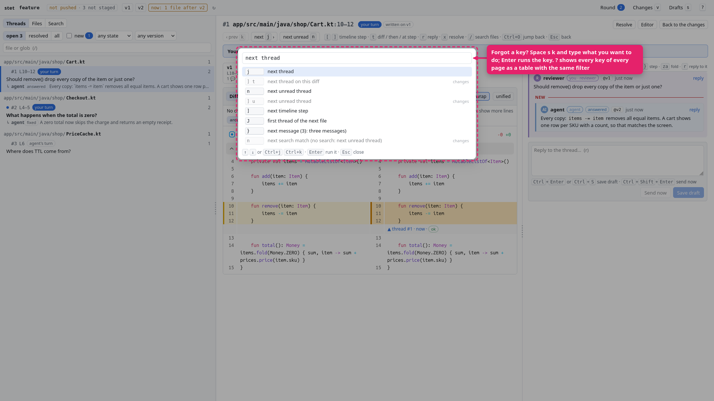

## Which code: from and to

The strip on the Changes page lists the code as it was at each step: `base` (where the branch started),
every version, and `now` (the working tree). The diff runs between two of them:

- **from** under a step: the old side of the diff is the code at that step;
- **to** under a step: the new side is the code at that step. If it would come before **from**, **from**
  moves along (and the other way round);
- a click on a step itself: only what changed in it (`v2`: from `v1` to `v2`; `now`: what is not saved as
  a version yet);
- a drag from one step to another sets both ends;
- keys: `]v` / `[v` move **to**, `}` / `{` move **from**.

The same pair is in the address, `#/compare/<from>..<to>`, and in `stet versions diff <from> <to>`. The
commit list uses **first** / **last** instead: the oldest and the newest commit to show, both included.

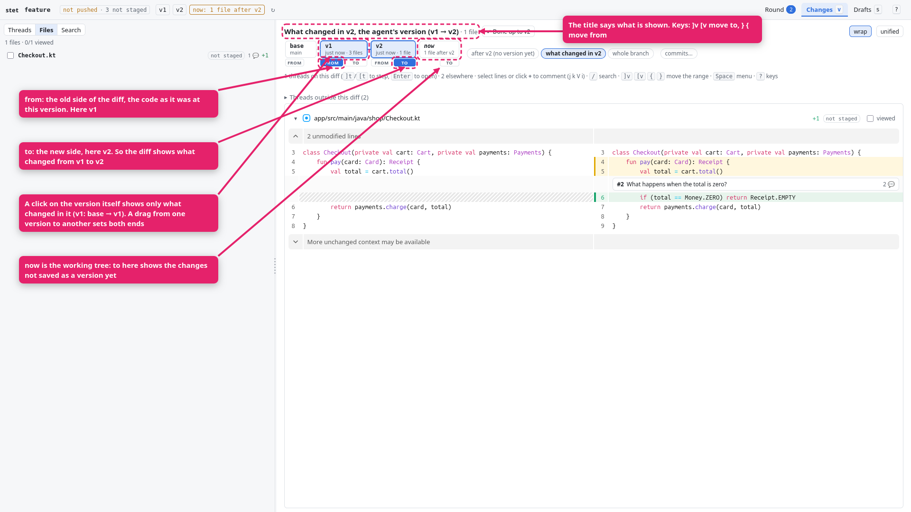

## Many versions

An agent hands over a version for every small step, and after a few rounds there are dozens. The newest
ones matter most, so nothing old is allowed to push them away:

- on the strip, the versions far from the range fold into one step (`v1…v38`). The range stays whole with
  a version on each side, so the keys still step on, and the newest three and `now` are always in view.
  A click on a folded step shows its versions; **find…** under it lists every version;
- **Space f v** (or the `v1…vN ▾` button in the header) lists every version, newest first, grouped by the
  review it answers. Type a number or words of the label the agent gave it: **Enter** shows what changed
  in it, **Shift+Enter** makes it **from**, **Ctrl+Enter** makes it **to**;
- a thread's timeline folds the versions where nothing happened to its code and nobody wrote;
- the Round page groups versions by review, with a link to everything the agent changed in that round;
  older rounds are folded.

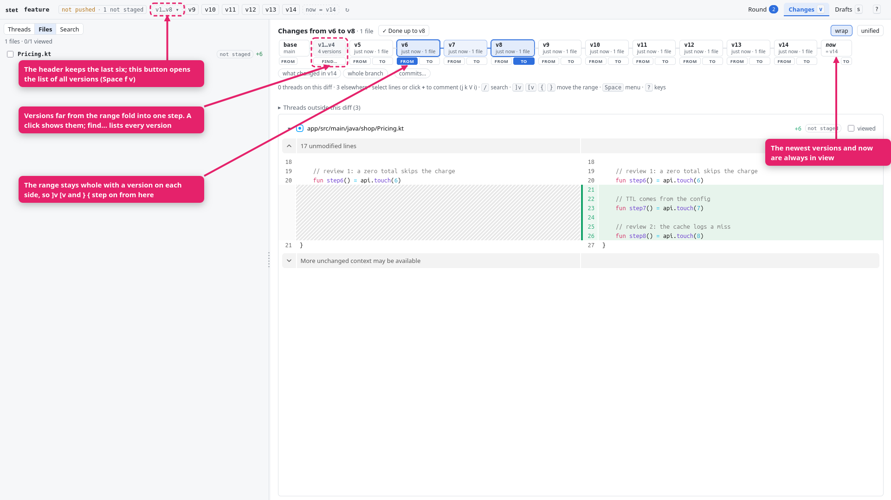

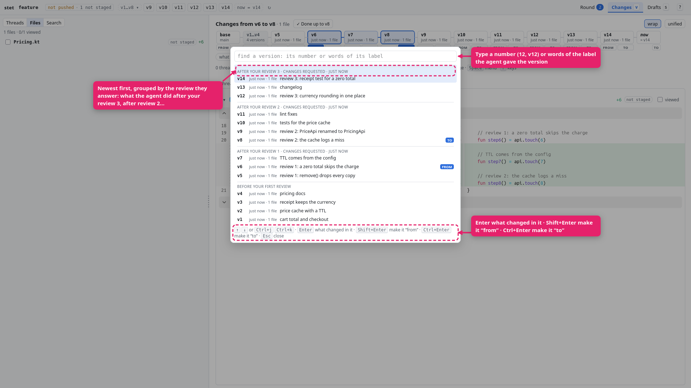

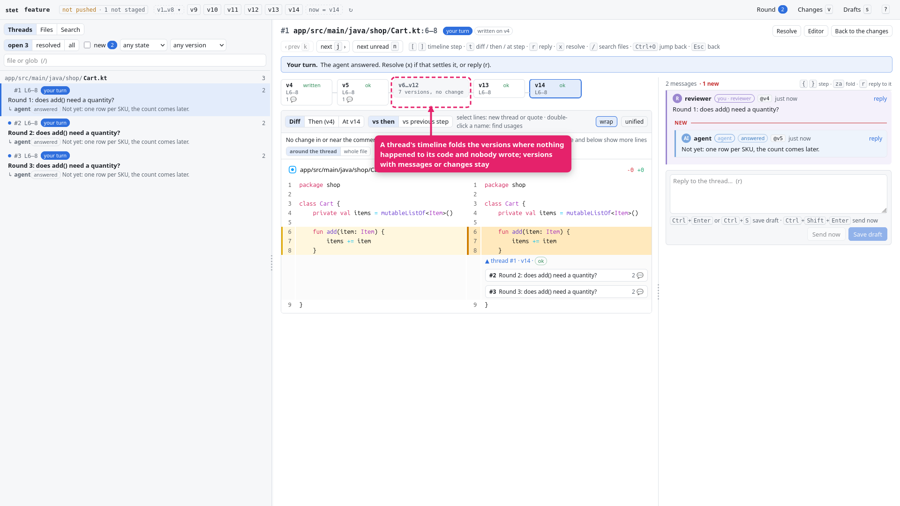

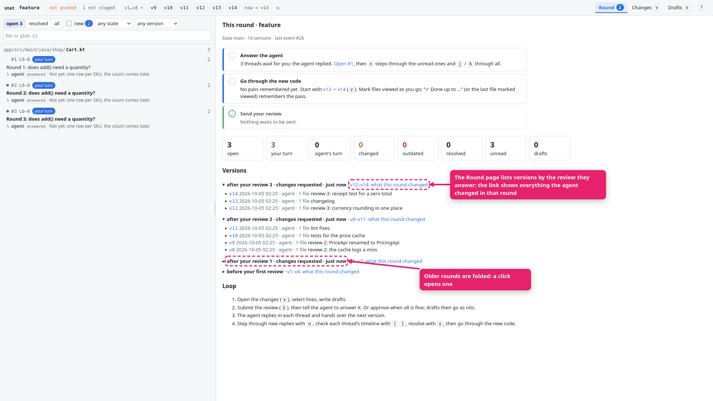

## Images

A png, jpg, gif, webp, bmp, ico, avif or svg file in the diff shows as pictures with its size and bytes before
and after. A changed one can be compared four ways: **side by side**, **swipe** (a divider to drag), **onion
skin** (the new one over the old, with an opacity slider) and **difference** (the pixels that differ in
magenta, with how many and a box around all of them). Icons are enlarged without blur.

An SVG is text too: the button on its header (**‹/› code** / **▣ picture**) switches between the picture and the
code diff. It opens as a picture, or as code when lines of it already have threads, and a jump to one of its
lines (search, a thread on lines) shows the code. An area on an SVG is measured in its own units (its
`width` × `height`, or the viewBox), so it stays put however big the picture is drawn.

A drag on either image frames an area and opens the comment box under the picture: the thread is on that
area as other threads are on lines, a draft until you submit, with replies and resolve. Frames of the
threads on an image are drawn over it; a click opens the thread.

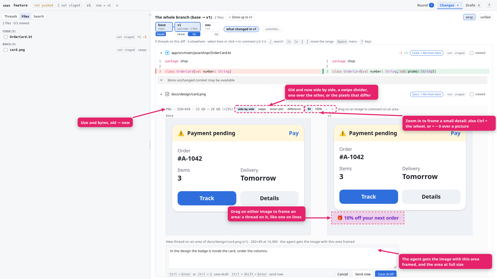

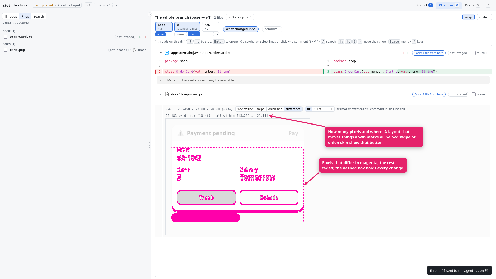

The thread page shows the area, or the whole image with the frame, at the step you pick, and each step
of the timeline shows the area at that version. The frame stays where you drew it (scaled if the image was
re-exported at another size); the thread is `changed` when the image changed and `outdated` when it is gone.

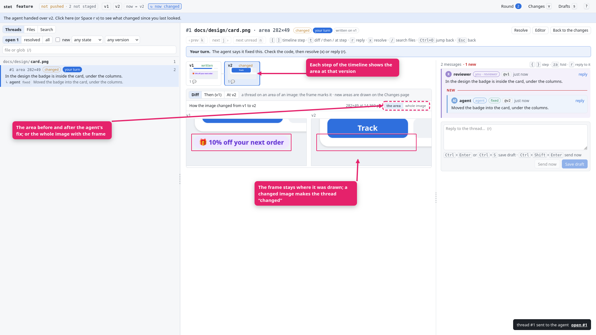

The agent cannot look at a page, so `stet thread show <id>` writes two PNGs under `.git/stet/shots/` and prints
their paths: the image with the area framed and the rest dimmed, and the area with a margin at full size
(small areas enlarged). The skill tells the agent to open them.

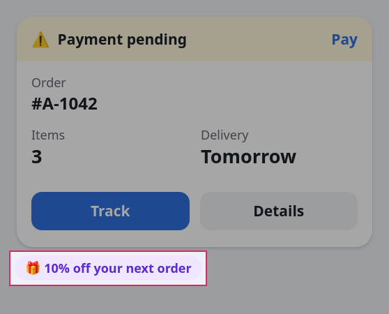

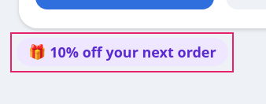

## Markdown

A Markdown file of the diff shows rendered (`stet config set compare.markdown code` makes code the default, and
**‹/› code** on its header switches one file, keeping your place on the screen). In split view the old version and
the new one stand side by side, block facing block, so a reader sees what changed in the text as it reads, not in
the markup: the words that changed are marked, items and rows of a changed list or table face each other, and an
added one faces an empty slot. Like the code, it shows the changes with the text around them and folds the rest into
bars that open it a piece at a time; what you open shows in the code too, and **full file** shows all of it. Pictures
of the repository load at the version of their side; pictures from the web are not loaded, raw HTML stays text.

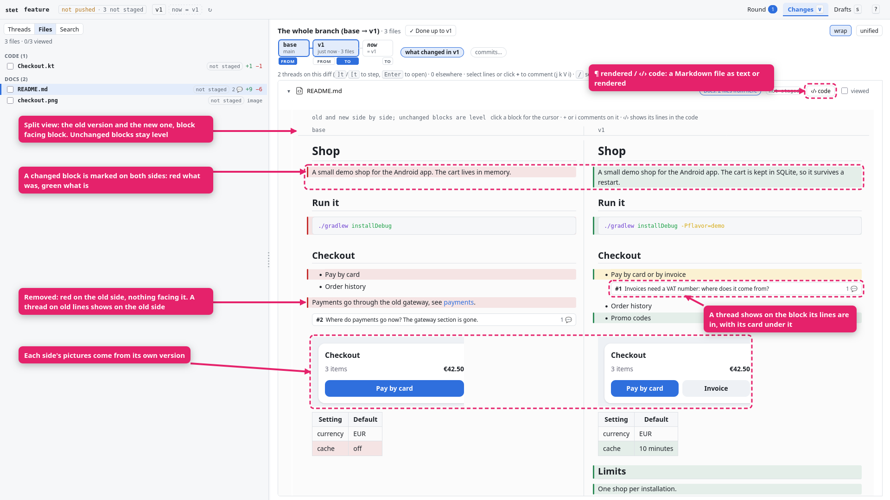

Threads are still on lines, so the agent gets the same thread as from the code. A thread shows on the blocks its
lines are in; **+** beside a block, or `i` on the block under the cursor, starts one on the block's lines. The
cursor keys of the code move over the blocks, and **‹/›** beside a block shows its lines in the code. Search
finds matches in the rendered text. A thread's own page shows the file rendered as well, with the same button: the
blocks around the thread, and each step of its timeline old beside new with the changed words marked.

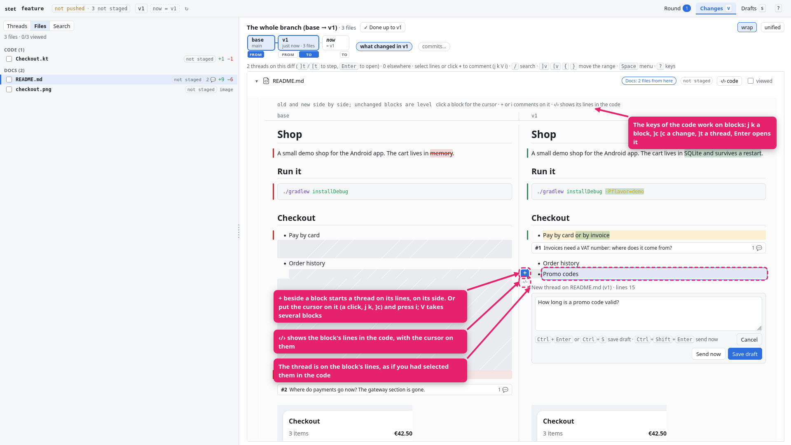

In unified view the text is one column: a block with a few words changed shows once with the changes in it, and so
does a list or a table, with added items and rows marked and removed ones struck through where they were. A block
that was rewritten or became another kind of block shows its old version, marked "was", above the new one.

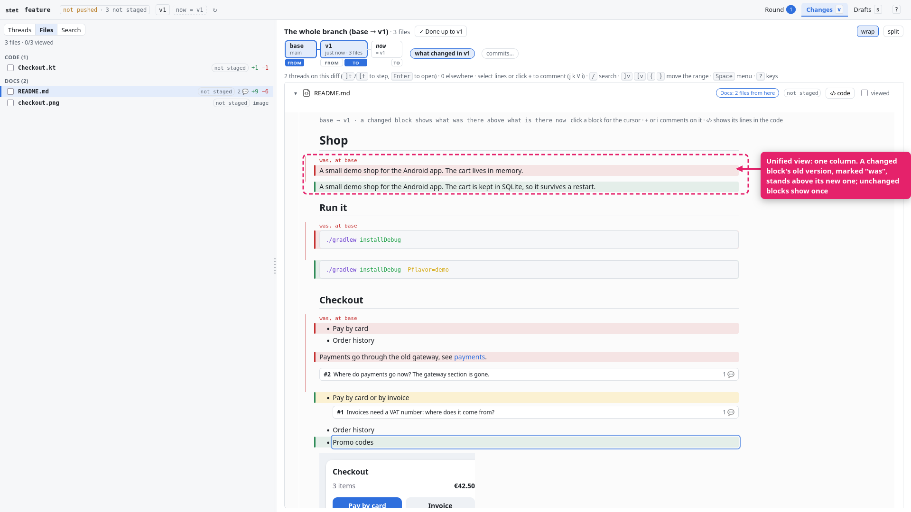

## Git state and fresh data

The header says where the branch is in git: `pushed`, `↑2 not pushed` (commits its remote branch does not
have), `not pushed · 3 commits` when no remote has the branch, `↓1` when the remote is ahead (as of the last
fetch), and how many files are staged, not staged and new. Each file in the Files tab and on its header in the
diff has the same mark: `not staged`, `staged`, `partly staged`, `new`, and `↑` when commits that are not
pushed changed it. A click on the line (or `Space g s`) lists the commits and the files.

In a review of the index (`stet init --staged`) every file of the review is staged, so that mark is left out;
instead the header counts the files that are **not in the review** because their changes are not staged, and
the list says so.

The page keeps itself up to date. Replies, resolves and versions arrive as they happen; the server also looks
at the worktree every few seconds while a page is open. When the agent edits code without handing over a
version, **↻ N files changed** appears next to "now": the page does not redraw under you, `R` (or a click)
re-reads "now". When the server stops, the header says **offline · retrying**; the page catches up when the
server is back. A restarted server takes the port it had, so open tabs keep working.

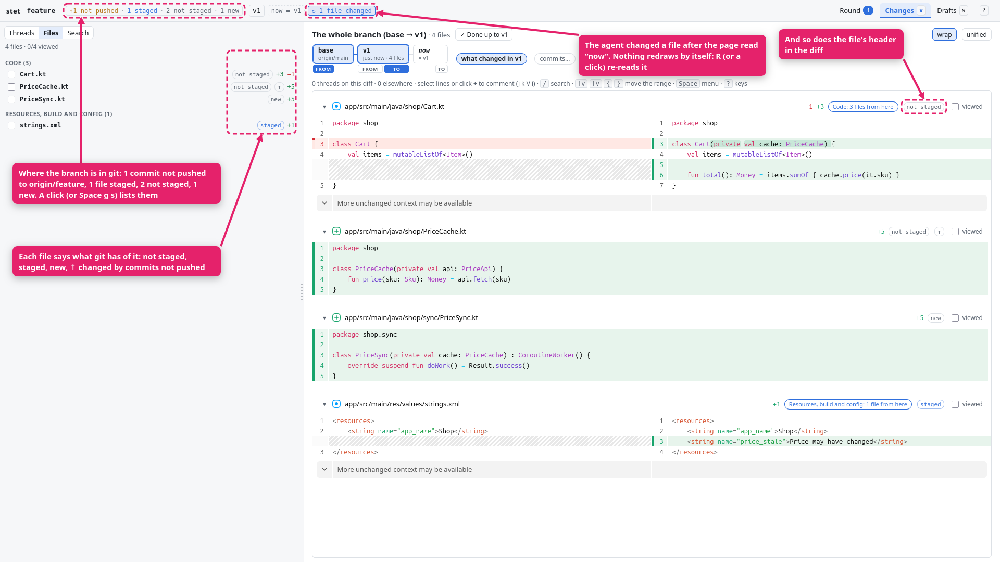

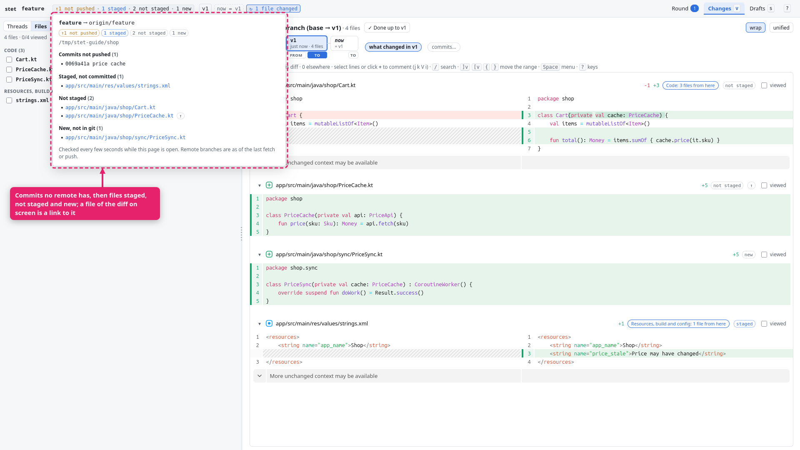

## Test files that only add code are folded

Nothing to switch on: the Changes page folds them by itself. The header says how many are folded and how
many changed tests stay; `Space u t` shows or hides the folded ones.

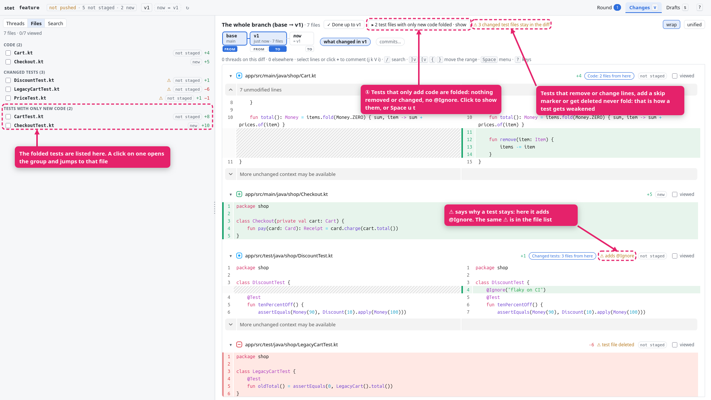

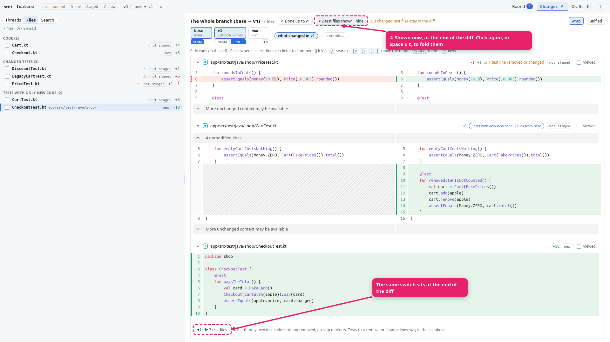

A test file folds when it matches `compare.tests` and only adds lines. It stays in the diff, with ⚠ and
the reason, when it removes or changes a line, adds a skip marker (`compare.skip_markers`: `@Ignore`,
`@Disabled`, `.skip(`, …), is deleted, or has a thread on the diff. Which paths are tests:

```bash
stet config set compare.tests "**/src/test/**,**/src/androidTest/**,**/*Test.kt"
```

## Check the agent's claim without leaving the thread

The agent says "fixed" but the thread's lines did not change. Find the usages of a name, open a hit next
to the conversation and quote it in the reply.

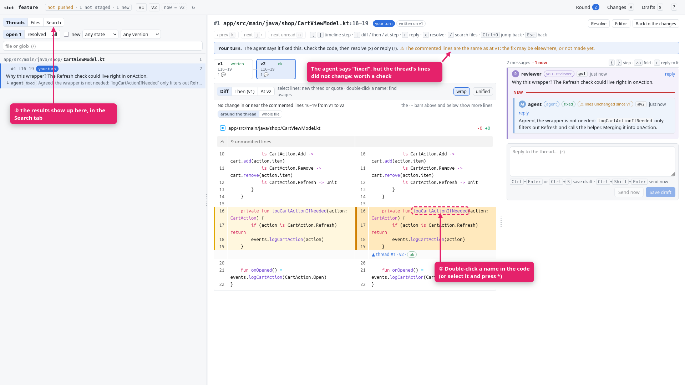

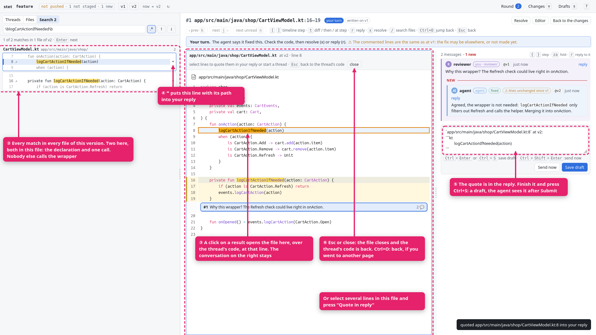

## Compare commits

**commits…** on the Changes page (or `Space g c`) lists the commits of the branch, newest first, with the
changes not committed yet on top. A click on a message shows that commit alone; **first** and **last** pick the
oldest and the newest commit to show, both included (the strip above then shows the two code states the
diff runs between: the parent of the first commit and the last one). `Esc` closes the list.

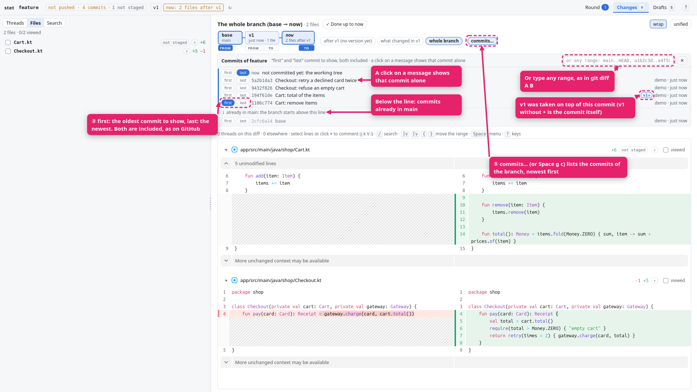

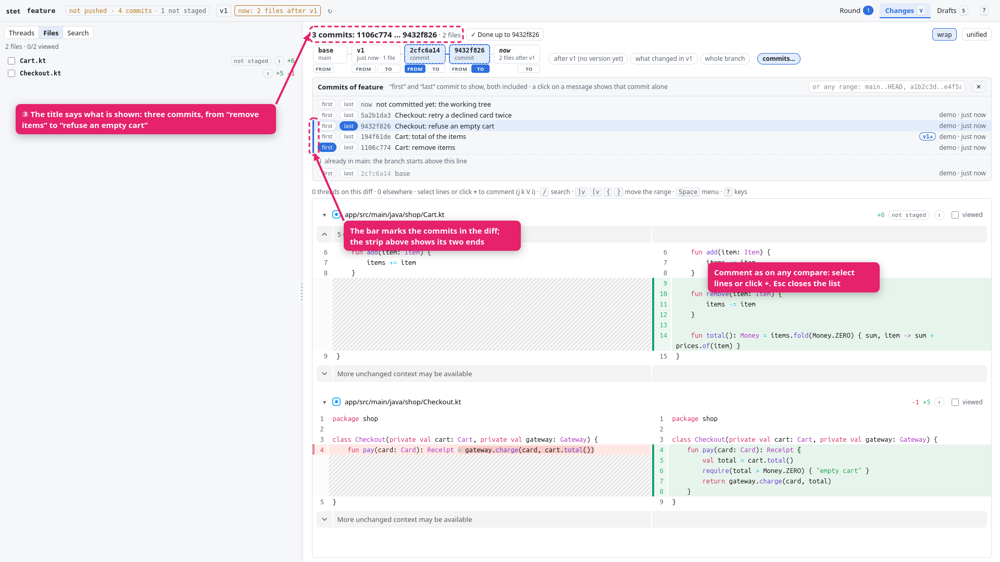

A tag `v2` on a commit means version 2 is that commit (`stet version create --at <commit>`); `v2+` means it
was taken on top of that commit, with the working tree or the staged changes.

## Long conversations

A thread opens where you stopped reading. Long messages you have read fold, and keys move a cursor over
the messages the way `j` / `k` move one over the diff.

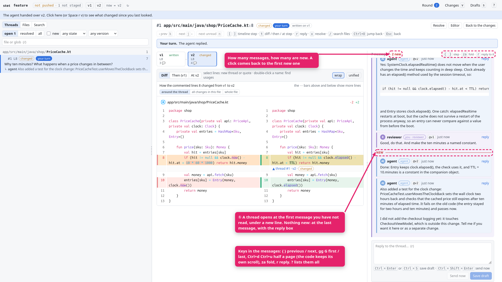

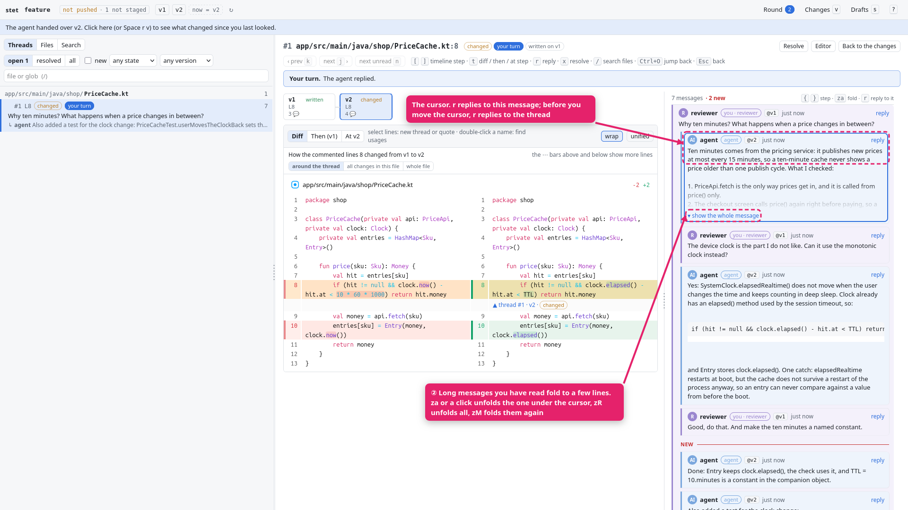

## Files are ordered by kind

Code first, then resources, build and config, changed tests, docs, and the folded groups last. Within a
group the path order stays. Another order, for example docs first:

```bash
stet config set compare.order "docs: **/*.md; code; config: **/*.json, **/*.xml, **/*.gradle.kts; tests"
```

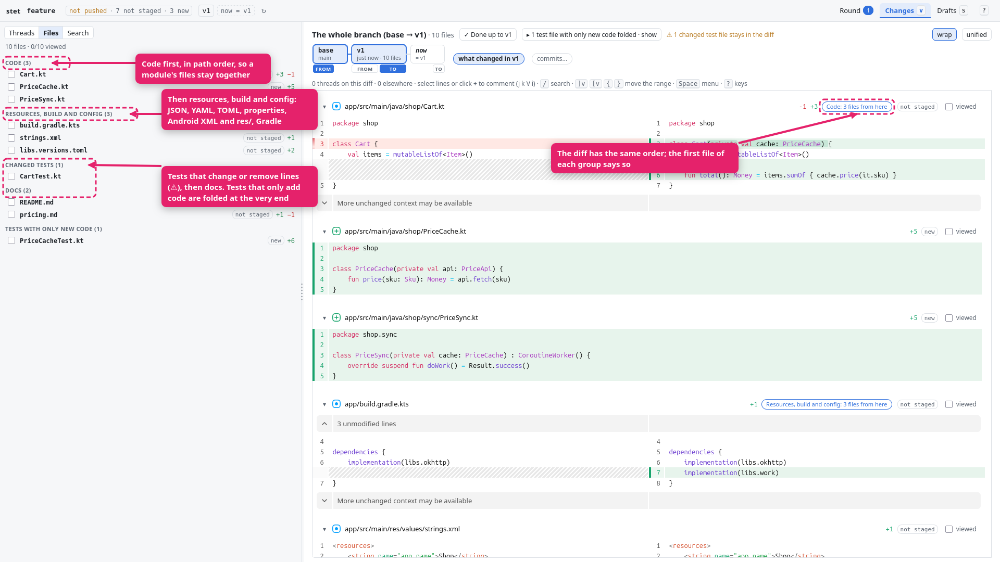
